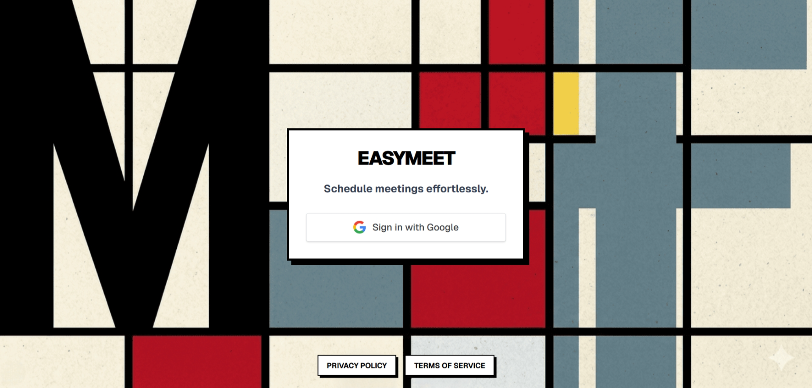
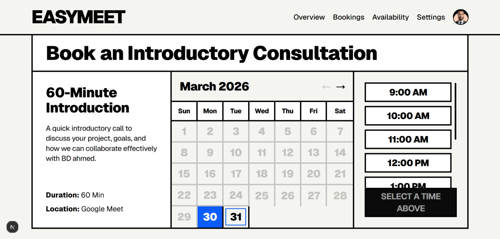
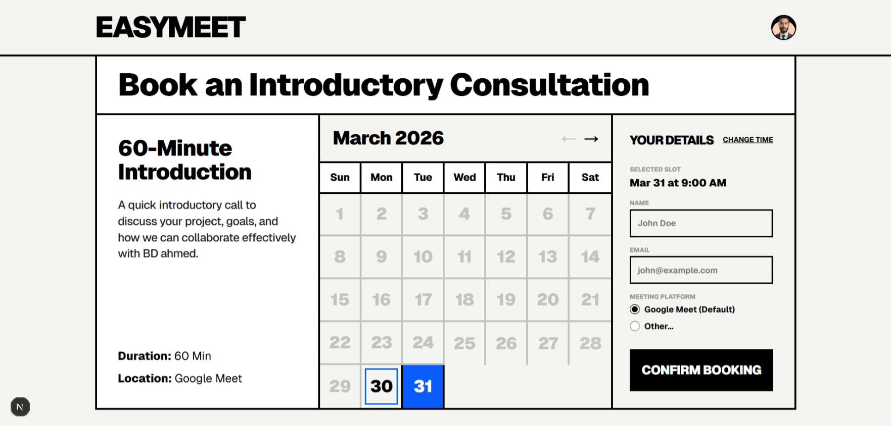

# EasyMeet: The Bold Way to Schedule.

<div align="center">
  <a href="https://calendly-style-booking-system.vercel.app/me">
    
  </a>
</div>

Tired of generic booking tools? **EasyMeet** is a modern, open-source scheduling engine designed for speed and style. Built on the cutting-edge **Next.js 15** stack, it combines the power of **Prisma** and **PostgreSQL** with a striking **neobrutalist aesthetic** that actually stands out.

Whether you're a freelancer, a consultant, or a small team, EasyMeet gives you full control over your calendar without the monthly subscription. Secure, responsive, and developer-friendly.

> [!WARNING]
> **Google Cloud Testing Mode Disclaimer**: This project is currently configured in "Testing" mode in the Google Cloud Console. 
> - Users will see a **"Google hasn't verified this app"** warning during sign-in. You can safely bypass this by clicking "Advanced" and "Go to [app name] (unsafe)".
> - Only **authorized test users** added in the Google Cloud Console can sign in. Ensure your email is added to the "Test users" list in your OAuth consent screen settings.

---

## 📸 Screenshots

<div align="center">
  <h3>Desktop View</h3>
  
  <br><br>
  <h3>Admin Dashboard</h3>
  
  <br><br>
  <h3>Public Booking Page</h3>
  
</div>

---

## 🚀 Key Features

-   **⚡ High Performance**: Optimized with Next.js App Router for lightning-fast page transitions.
-   **🔐 Secure Authentication**: Integrated with Google Auth via Next-Auth for a smooth user experience.
-   **📅 Smart Scheduling**: Intuitive calendar interface to manage availability and handle time-zone-aware bookings.
-   **🎨 Unique UI/UX**: Bold neobrutalist design that stands out from typical SaaS interfaces.
-   **📱 Fully Responsive**: Seamless experience across mobile, tablet, and desktop devices.
-   **🛠️ Admin Dashboard**: Centralized management of availability, duration, and upcoming bookings.
-   **✉️ Email Notifications**: Automated confirmations and notifications to keep everyone in the loop.

---

## 🛠️ Tech Stack

-   **Framework**: [Next.js](https://nextjs.org/) (App Router & Server Actions)
-   **Database**: [PostgreSQL (Neon)](https://neon.tech/) with [Prisma ORM](https://www.prisma.io/)
-   **Authentication**: [NextAuth.js](https://next-auth.js.org/)
-   **Styling**: [Tailwind CSS](https://tailwindcss.com/)
-   **Deployment**: [Vercel](https://vercel.com/)
-   **Icons/Images**: Custom SVG icons and Next.js Image optimization

---

## 🏁 Getting Started

### 1. Clone & Install
```bash
git clone https://github.com/your-repo/easy-meet-booking-system.git
cd easy-meet-booking-system
pnpm install
```

### 2. Configure Environment
Create a `.env` file from the example:
```bash
cp .env.example .env
```
*(Fill in your database URL, authentication secrets, and key environment variables)*

### 3. Database Setup
```bash
npx prisma generate
npx prisma db push
```

### 4. Run Development Server
```bash
pnpm dev
```
Visit [http://localhost:3000](http://localhost:3000) to see your app in action!

---

## 📄 License

This project is licensed under the MIT License.

---

## 🔗 Connect with me

-   **Portfolio**: [abidiahmed.com](https://abidiahmed.com)
-   **Email**: [contact@abidiahmed.com](mailto:contact@abidiahmed.com)
-   **Live Demo**: [EasyMeet Demo](https://calendly-style-booking-system.vercel.app/me)
